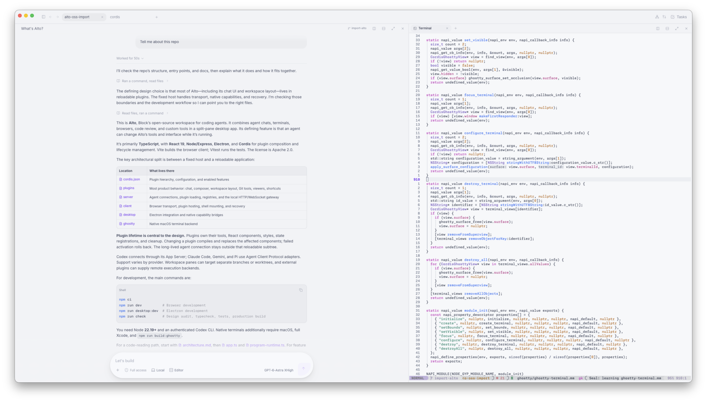

# Alto

**A programmable workspace for your coding agents.**



Alto brings your coding agents and tools into one workspace you can change while it’s running. 

- **Change Alto while it’s running.** Ask your agent to add a panel, register a tool, or change the UI. Alto compiles and reloads the affected plugins. Failed activation rolls back.
- **Use your existing agent harnesses.** Connect through ACP, or use Codex App Server for native history, approvals, queueing, steering, and subagent inspection.
- **Run parallel work in separate checkouts.** Give chats their own worktrees and working directories. Arrange them in tabs and split panes, and reopen saved conversations from history.
- **Keep terminals, browsers, and diffs beside your chats.** Run commands in native libghostty terminals, inspect changes, and open browser panes. Switching tabs preserves running sessions and drafts.

Alto uses [Cordis](https://arxiv.org/pdf/2608.25512) to manage plugin dependencies, lifecycle, and hot reloading. DeepSeek Harness uses the same foundation, but implements its own agent loop. Alto connects to existing harnesses and leaves that loop to them.

Like DeepSeek Harness, Alto is built on [Cordis](https://arxiv.org/pdf/2608.25512). Unlike DeepSeek Harness, Alto leaves the agent loop to the harnesses you already use. They handle model requests and tool calls; Alto provides the workspace around them—and lets your agents change that workspace while it’s running.

Alto is under active development and is pre-alpha. 
At Block, Alto is a small tool: for Block's other agentic tools, check out [Buzz](https://github.com/block/buzz) and [Berd](https://github.com/block/berd/)

[Get started](#get-started) · [Agent support](#agent-support) ·
[Customize Alto](#make-alto-your-own) · [Development](#development) · [FAQ](#faq)

## A workspace for the whole task

**Keep several pieces of work in view.** Arrange Chat, Terminal, Browser, and
Canvas panes in resizable splits. Group workspace tabs, switch between recent
chats, and pin frequently used conversations. Switching tabs keeps inactive
panes mounted, including their drafts, shells, and browser sessions.

**Give each chat the right working directory.** Register project folders,
select existing branches and worktrees, or ask the agent to create a branch and
open an independent chat for it. A chat's execution target follows its selected
checkout. Remote targets become available through backend plugins.

**Stay involved while agents work.** Inspect tool calls, respond to approvals,
queue follow-up messages, and steer an active turn when the provider supports
it. The Agents panel exposes subagent progress and transcripts. Tasks organizes
work by project and lets you file chat tabs under individual tasks. Scheduled
runs recurring Codex tasks while Alto is running, or through an external
scheduling provider.

**Review changes where the conversation happens.** Open source files and diffs,
leave inline comments to send back to chat, and generate Code Tours that pair
an explanation with the relevant changes. GitHub integration shows pull
requests, checks, and review status. The Editor action opens the current local
checkout in Cursor, VS Code, or Zed.

**Keep supporting material close.** Conversations render Markdown, highlighted
code, Mermaid diagrams, and mathematics. Linked source, Markdown, and PDF files
open in viewers. Native Ghostty terminals and embedded browser tabs sit beside
your chats; Canvas provides full-page space for tools you or the agent build.

## Get started

### Prerequisites

- **Node.js 22.19 or newer** and Git. `nix develop` provides Node 22 and the
  command-line build tools if you prefer the pinned development environment.
- **An agent of your choice**, installed and authenticated through its own CLI.
  [Codex CLI](https://developers.openai.com/codex/cli/) is only required for
  Codex. See [agent setup](docs/agent-providers.md#local-setup) for runtime and
  adapter configuration.
- **macOS and a full Xcode installation** for the desktop app's native Ghostty
  terminal. The Command Line Tools alone are insufficient for that build.

Clone the repository and install its dependencies:

```bash
git clone https://github.com/block/alto.git
cd alto
npm ci
```

If using Nix, enter `nix develop` after `cd alto` and before `npm ci`. Agent CLIs
and Xcode are installed separately. For Codex, run `codex login` before your
first Codex chat; Alto starts App Server when you use a Codex feature.

### Run the desktop app

Build the native terminal once, then start the development app:

```bash
npm run build:ghostty
npm run desktop:dev
```

The native build downloads pinned Ghostty and Zig sources and builds the
terminal bridge. You do not need a separate Ghostty application installed.
See the [native backend notes](native/ghostty/README.md) for build details.

To build and install `Alto.app` in `~/Applications`:

```bash
npm run install:mac-app
open ~/Applications/Alto.app
```

This development installation links back to your checkout, so keep the checkout
in place. Closing the macOS window keeps the workspace running; **Cmd–Q** quits
Alto and stops ordinary terminal processes.

For terminal sessions that survive an Alto restart, install `tmux`, enable
**Terminal Persistence** in Plugins, and open new terminals. This extension is
disabled by default. See [terminal persistence](docs/terminal-persistence.md)
for session ownership, shutdown behavior, and limitations.

### Run in a browser

```bash
npm run dev
```

Open the **complete URL printed in the terminal**. The default origin is
`http://127.0.0.1:4317`; the startup URL also establishes your local browser
session. `ALTO_PORT` selects a different port for browser mode.

Browser mode is useful for chat and plugin development. Native Ghostty terminals
and embedded web browsing require the desktop app. Alto is a local, single-user
application.

### Start working

Choose a project folder, open a chat, and select the agent before sending the
first message. Use the split controls to place another chat or a supporting
pane beside it. For example, you can ask:

> Create a branch called docs-cleanup from origin/main and open it in a new
> chat pane to the right.

A few default macOS shortcuts:

| Shortcut | Action |
| --- | --- |
| Cmd–K | Search commands, chats, and settings |
| Cmd–D / Cmd–Shift–D | Split beside / below the focused pane |
| Option–Tab | Switch between recent workspace tabs |
| Ctrl–Tab / Ctrl–Shift–Tab | Move to the next / previous workspace tab |
| Cmd–Shift–H | Open chat history |
| Cmd–Shift–A | Toggle the Agents panel |
| Tap Option outside text inputs | Open the leader-key shortcut menu |

The leader key and its action bindings can be changed in Hotkeys. GitHub
features use the `gh` CLI; run `gh auth login` before using pull request and
check information.

## Agent support

Alto connects to any agent that speaks **Agent Client Protocol (ACP)**,
natively or through an adapter. Configure its command and arguments in
`program/cordis.json`. Each agent keeps its own runtime and authentication.
Alto provides the shared chat interface, workspace context, and tools for
working with and changing the application.

**Codex uses App Server for richer interactions with its runtime**, including
native history, approvals, queued messages, steering, and subagent inspection.
Alto starts `codex app-server` on demand, so Codex CLI is only needed when you
use Codex features.

An agent is fixed after a chat's first message. Model choices, attachments,
steering, and session resumption follow the capabilities the provider exposes.
Code Tour generation and local scheduled tasks currently use Codex.

Permission controls also follow the provider. ACP approval handling does not
add Codex's sandbox to another agent. See [agent providers](docs/agent-providers.md)
for authentication, adapter versions, capability differences, and known limits.

## Make Alto your own

Ask a local agent to change Alto as part of your normal conversation. Example
requests that create or modify plugins:

> Add a Canvas page for this project with a checklist that persists between
> sessions.

> Add a composer action that opens this project's documentation in a Browser
> pane.

> Add a keyboard shortcut that focuses the terminal beside this chat.

These changes live in ordinary source files under `program/`. The agent can
inspect the running program, discover its tools and UI, and submit a change
through Alto's reprogramming tools. Alto compiles and activates the affected
plugins in place. If compilation or activation fails, it rolls back the change.

A change made from a turn that started with **Full access** applies immediately.
**Ask** and **Auto** turns produce a proposal for approval. You can also explicitly
ask to review a change before it is applied.

Open Plugins to inspect, configure, enable, or disable entries. A plugin owns
its tools, UI, styles, and registrations;
[Cordis](https://github.com/cordiverse/cordis) manages their lifetime and removes
them when that plugin unloads. The fixed host keeps transport, native integration,
and recovery available while the program changes.

For source builds, the program lives in your checkout. Saved application state
uses the ignored `.codex-cordis/` directory and browser storage. Keep program
changes you want to share under version control.

New chats without a selected project work in `~/.alto/scratch`. Alto creates
this directory automatically and keeps its files between launches, separate
from the executable program. Selecting a project uses that project's directory;
reopening an existing conversation keeps its saved working directory.

### External plugins and remote work

Additional plugins can live outside the Alto repository. Each directory has an
`alto-plugins.json` manifest that declares where its entries attach to the
built-in program:

```bash
ALTO_PLUGIN_DIRS=/absolute/path/to/my-alto-plugins npm run desktop:dev
```

For launches from Finder or the Dock, configure the same directories in the
ignored local file `.codex-cordis/plugin-directories.json`, then restart Alto:

```json
{
  "version": 1,
  "directories": ["/absolute/path/to/my-alto-plugins"]
}
```

On macOS, separate multiple `ALTO_PLUGIN_DIRS` paths with `:`. External plugins
are trusted application code. Their source is watched for reloads and is
read-only through Alto's built-in reprogramming tools.

Remote execution becomes available when a plugin registers a backend. The
backend supplies authentication, provisioning, and process transport; Alto
provides chat, approvals, replay, and reconnect handling. A backend can keep
agent processes running while Alto is disconnected. See the
[remote agent contract](docs/remote-agents.md) and
[external plugin guide](docs/plugin-authoring.md#external-plugin-directories).

## Development

The feature code lives in the Cordis program. The smaller fixed host handles
processes, transport, plugin loading, native capabilities, and recovery.

| Location | Responsibility |
| --- | --- |
| [`program/cordis.json`](program/cordis.json) | Plugin hierarchy, defaults, configuration, and enabled features |
| [`program/plugins/`](program/plugins/) | Agent integrations, tools, React surfaces, styles, and workspace behavior |
| [`src/server/`](src/server/) | App Server connection, program runtime, registries, and local web gateway |
| [`src/client/`](src/client/) | Browser plugin host, transport, shell mounting, and recovery |
| [`src/desktop/`](src/desktop/) | Electron application and native capability bridges |
| [`native/ghostty/`](native/ghostty/) | macOS terminal bridge and native build |

Useful commands, after `npm ci`:

| Command | Purpose |
| --- | --- |
| `npm run dev` | Browser development server |
| `npm run desktop:dev` | Electron app with development assets |
| `npm run build` | Client, server, and desktop preload builds |
| `npm run check` | Design-system audit, typecheck, tests, and production build |
| `npm test -- tests/todo.test.ts` | Run one test file |
| `npm run test:paper` | Focused Cordis lifecycle and composition checks |
| `npm run build:mac-release` | Build a self-contained app in `dist/mac/Alto.app` |

`nix run .#check` and `nix run .#build-ghostty` wrap the corresponding commands
with the pinned toolchain. GitHub Actions runs checks on pushes to `main` and
on pull requests. Version tags trigger the macOS Apple Silicon release workflow.

Unlike a development installation, a portable release bundles its dependencies
and application assets. On first launch, it copies the mutable program into the
user's Application Support directory, so live customization can persist there.
Release builds are currently ad-hoc signed and are not notarized.

Read the [architecture](docs/architecture.md) for the runtime boundaries and
[plugin authoring guide](docs/plugin-authoring.md) for server and browser APIs,
dependency declarations, UI ownership, and cleanup. The
[Cordis conformance notes](docs/paper-conformance.md) describe the lifecycle
properties covered by the tests.

## Contributing

See [CONTRIBUTING.md](CONTRIBUTING.md) for setup, validation, and pull request
guidance. Use [GitHub issues](https://github.com/block/alto/issues) for bugs,
questions, and proposed changes. [CODEOWNERS](CODEOWNERS) lists the default
reviewer; [GOVERNANCE.md](GOVERNANCE.md) describes project governance.

## License

Alto is licensed under the [Apache License, Version 2.0](LICENSE).
See [NOTICE](NOTICE) for the original license notice retained with the imported
source.

## FAQ

### Why is it called Alto?

The name is a nod to the [Xerox Alto](https://en.wikipedia.org/wiki/Xerox_Alto),
the computer introduced at Xerox PARC in 1973 that helped pioneer graphical
personal computing and hosted early Smalltalk environments.

That is the idea behind this Alto: the environment you work in should be
something you can change. Your agent can add a tool, build a panel, or reshape
a workflow while you're using the application.

### Does Alto own the agent loop?

Alto uses your existing coding agents through ACP or Codex App Server.
Each agent owns its cycle of model requests and tool calls.
Alto adds the graphical workspace, context about that workspace, and tools for
working with and changing the application. It does not implement a replacement
agent loop.

### How does Alto compare with other tools?

Alto's pane splitting and tabbed workspace draw inspiration from
[Zellij](https://zellij.dev/) and [Herdr](https://herdr.dev/). Alto brings those
ideas to a layout that combines graphical agent chats, terminals, browsers,
and custom tools.

| Project | What it provides | Where Alto differs |
| --- | --- | --- |
| [DeepSeek Harness](https://github.com/deepseek-ai/deepseek-harness/blob/master/docs/architecture.md) | A Cordis-based harness with a replaceable agent loop, model adapters, tools, and UI. It also supports live extensions. | Alto also uses Cordis for live customization, but connects to existing agent runtimes through App Server or ACP. The agents keep their own loops; Alto provides the workspace around them. |
| [Pi](https://github.com/earendil-works/pi/blob/main/packages/coding-agent/README.md) | An extensible coding agent with a terminal interface, RPC mode, and a TypeScript SDK for building applications around it. | Alto is a GUI with split chats, native terminals, browsers, worktrees, and code review around your choice of agent. |
| [Claude Mods](https://code.claude.com/docs/en/plugins/mods/overview) | JavaScript or TypeScript hooks inside Claude Code that can change tool behavior and draw or restyle UI in supported Claude interfaces. | Alto plugins change a separate application shared by several agent providers. You can change its chat views, panes, shortcuts, and workflows while continuing to use your preferred agent underneath. |
| [Codex Plugins](https://developers.openai.com/plugins/concepts/plugins) | Installable bundles of skills, MCP tools, integrations, and lifecycle hooks, with optional UI on supported surfaces. | Alto's Cordis plugins implement the running workspace itself: chat, panes, commands, and application tools. They let you change the workspace around Codex and other agents. |
| [Zellij](https://zellij.dev/documentation/creating-a-layout.html) | A terminal workspace with split panes, tabs, reusable layouts, and plugins. | Alto applies a similar pane model to graphical agent conversations, native terminals, browser pages, and custom React views in the same workspace. |
| [Herdr](https://herdr.dev/docs/concepts/) | A terminal workspace for multiple coding agents, with split panes, agent status, and persistent sessions. Each agent runs in its own terminal. | Alto shares the idea of keeping several agents in view. It renders conversations and approvals through App Server or ACP alongside browsers, code review, and native terminals. |

Provider capabilities and current integration limits are listed under
[Agent support](#agent-support).
