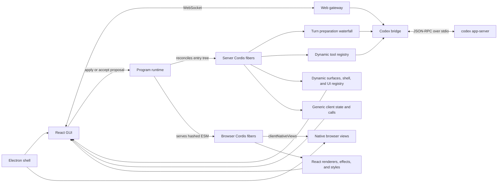

# Architecture

Alto keeps long-lived infrastructure separate from the program that is expected to change.



## Long-lived services

The root Cordis context owns eight services:

1. `tools` stores dynamic tool definitions and handlers. Registrations are effects owned by the plugin context that created them. App-server sees one stable dispatcher whose calls resolve this registry live.
2. `turnProgram` runs `codex/turn/prepare` as a waterfall before each `turn/start` request.
3. `ui` stores independently owned surface definitions, one declarative application shell, exclusive shell regions, named-slot contributions, and action handlers. Each registration disappears with the fiber that created it.
4. `clientExtensions` is one generic server-to-browser state and method channel. State and methods are owned effects, so unloading a plugin removes both without adding feature-specific cases to the gateway.
5. `projects` persists named local projects, their primary and attached folders, and classifies task working directories. Direct descendants use longest-root matching; Git worktrees match through their common Git directory.
6. `program` loads the declarative profile, compiles modules, and owns only the dynamic plugin fibers.
7. `codex` owns the child process and JSON-RPC state. It routes app-server tool requests to `tools` and forwards approval requests to the browser.
8. The web gateway serves the React build and broadcasts state over a local WebSocket.

The Codex bridge and web gateway are outside the reloadable subtree. Reloading the program therefore does not interrupt the app-server process, active Codex threads, connected browsers, or pending approvals.

Each connected browser also owns a long-lived `BrowserProgramRuntime`. It provides `clientHost`, `clientUi`, and the narrow `clientNativeViews` desktop capability to a second Cordis context, imports the content-addressed bundles advertised in the program snapshot, mirrors the server entry hierarchy, isolation, and interception, and reconciles individual browser fibers. `clientHost` owns transport, native commands, and the raw event journal. `clientUi` owns renderer, stylesheet, overlay, and submit-middleware registrations. `clientNativeViews` has no product UI or URLs; it only lets a plugin mount an authenticated HTTP(S) browser surface when the app is running in Electron. Product state such as tasks, activity cards, models, workspaces, and skills is projected by the reloadable `session` fiber, not by any fixed service.

## Cordis composition

Spatial composition comes from `provide` and `inject`. For example, `shell-ui` injects `uiDefaults`, which `ui-surfaces` provides only after registering the default surfaces. Cordis keeps the shell pending without that provider, unloads it when the provider disappears, and reactivates the same shell fiber when a matching provider returns.

Module-less profile entries create stable parent scopes. Their `children` form the program tree. `isolate` remaps a service name to a private or named realm for the whole subtree, so two graphs can provide the same logical service without colliding. `intercept` layers service configuration over descendants; the default interface group uses it to name its logger.

Temporal composition comes from effects. Tool registrations, the UI shell, shell regions, UI contributions, action handlers, and event listeners belong to the context that installed them. Disposing the fiber runs those inverse operations, so a reload cannot leave an old capability or interface registered beside its replacement.

The React application is intentionally a mount interpreter rather than the owner of the product surface. Its shell vocabulary provides nested boxes, semantic regions, layout tokens, optional named slots, exclusive outlets, labels, direct contribution references, and references to Cordis-owned surfaces. Surface kinds are open strings. A browser plugin may register a renderer for one exact surface ID or any surface kind, and captures whichever Cordis services it injects. That renderer is arbitrary React, not a kernel-selected widget schema. Slots are the easy additive path; outlets let one fiber own a complete replaceable shell subtree; direct references let the program place a contribution anywhere in the shell tree.

The fixed browser kernel keeps the WebSocket connection and event journal, mounts shell nodes, hosts the browser Cordis context, and exposes <kbd>Cmd/Ctrl</kbd>+<kbd>Shift</kbd>+<kbd>P</kbd> as a recovery path. It does not contain Search, sidebar, conversation, composer, steering, settings, Plugins, task-history, or session-projection implementations. Those live below `program/plugins`. Disabling one entry removes its behavior while the kernel and unrelated fibers stay mounted. The recovery renderer remains available if a malformed program removes its own controls.

## Typed core

The UI protocol is an algebraic data type with separate interpreters. The fixed browser shell interpreter folds only layout nodes into mounts. The default interface fiber registers the contribution interpreter that folds interactive nodes into controls, so that renderer and its styles unload with the rest of the interface. The server-side language boundary validates both trees before they enter the registry.

Lifecycle types carry the remaining invariants. A server source becomes a `CompiledPlugin`; a browser source becomes a `CompiledClient` with a hash and retained artifact. Mounting either inside a stable entry produces a live component with a non-optional fiber and config identity. The default session fiber models link, turn, and history lifecycles as discriminated unions. Native browser command payloads and results are indexed by the command discriminant; plugin-specific calls use the generic JSON extension boundary instead of widening the kernel command union.

The profile is data rather than bootstrap code:

```json
{
  "version": 2,
  "plugins": [
    {
      "id": "interface",
      "name": "Interface",
      "description": "Owns the replaceable application interface and its isolated services.",
      "enabled": true,
      "isolate": { "uiDefaults": true },
      "intercept": { "logger": { "name": "interface" } },
      "children": [
        {
          "id": "ui-surfaces",
          "name": "Chat Interface",
          "description": "Renders the conversation, composer, settings, and plugin controls.",
          "module": "plugins/ui-surfaces.ts",
          "client": "plugins/ui-surfaces.client.tsx",
          "enabled": true,
          "config": {}
        }
      ]
    }
  ]
}
```

## Transactional reload

`ProgramRuntime` serializes reloads and follows this sequence:

1. Parse the complete recursive profile and reject duplicate IDs across the tree.
2. Bundle every enabled module in memory and hash its output. Unchanged hashes reuse the existing imported module.
3. Create, retain, or remove entry scopes by stable ID. A changed isolation or interception policy replaces only that subtree.
4. Inside each retained scope, leave an unchanged component alone, restart its existing fiber for a config change, or replace only that component fiber for a module or code change.
5. Reconcile child maps recursively. Cordis `inject`/`provide` reactivity suspends consumers while their provider is absent and reactivates the same consumer fibers when it returns.
6. If any activation fails, reconcile the mutated tree back to the previous profile and compiled modules. UI broadcasts are batched, so the browser observes a complete old or new UI snapshot.
7. Commit the new profile, source view, fingerprint, and revision only after activation succeeds.

GUI writes add a file transaction around the same process. Original contents are held in memory, each replacement is written with a same-directory rename, and any reload failure restores all originals before remounting the previous program.

Filesystem watching uses the same reconciliation queue. Changes from an editor and changes from the GUI cannot activate concurrently.

After the server commits a revision, each browser independently performs the corresponding client transaction:

1. Import only client bundles whose module or content hash changed. React, JSX, and Cordis resolve to the host's singleton instances.
2. Reconcile the mirrored entry tree, retaining unchanged scopes and components.
3. Dispose and replace only changed client fibers. Registry notifications are batched, so React sees a complete old or new set of renderers and styles.
4. If activation throws, reconcile back to the previous client modules and report the failure through the fixed recovery layer.

Active browser artifacts are never cache-pruned. The server validates a reused artifact still exists and serves bundles by entry ID plus full content hash.

## App-server flow

Startup sends `initialize` with `experimentalApi: true`, followed by `initialized`. The bridge then loads the model catalog.

A new GUI task sends exactly one `cordis` function tool in `thread/start`. Each message passes through the current turn waterfall before `turn/start`, which lets newly loaded middleware affect an already-running task.

While a turn is active, the default steering plugin consumes normal composer submissions into its draggable local queue. A queued row can be removed, left for the next turn, or sent immediately through `turn/steer`. The bridge always supplies the active turn as `expectedTurnId`, so app-server rejects a stale steering request. <kbd>Cmd/Ctrl</kbd>+<kbd>Enter</kbd> calls `turn/interrupt` for that same active turn. All queue UI, shortcuts, and submit interception are owned by the steering browser fiber.

The history primitive pages through recent interactive tasks with `thread/list`. The project registry assigns each task to a configured local project by attached folder or Git worktree; unmatched and explicitly unscoped tasks share the bottom `Recents` group. Selecting an entry calls `thread/resume`; the bridge reduces app-server's stored thread to a small summary plus user and agent messages before sending it to the browser. Workspace-scoped tasks use the selected project's primary folder, while an unscoped tab keeps a working directory without acquiring a project assignment. The default sidebar plugin places this primitive in its rail, but the bridge and base shell do not decide whether it is rendered.

Workspace Layout is the spatial compositor. It persists workspace tabs and split trees whose leaves are registered pane kinds: the built-in Chat pane plus plugin-owned Terminal, Browser, and Canvas panes. The compositor owns placement, resize, focus, full screen, and visibility; it does not know how a pane renders or behaves. A user-initiated split first chooses a pane kind instead of silently creating a Chat. Unloading a pane plugin removes its renderer while leaving a clear placeholder for persisted layouts, and reloading it restores that pane in place.

Pane Tabs is a shared browser-fiber UI primitive; it supplies only tab selection, closing, creation, and drag reordering. Terminal, Browser, and Canvas each own their own tab state and resource lifecycle. Inactive terminal and browser tabs stay mounted but hidden, preserving their PTYs and `WebContentsView` instances until the tab or pane is actually closed.

Canvas is one pane kind. Its browser fiber provides workspace-scoped page and dock registries, and each project workspace persists its own free-form page list. A page plugin owns the whole tab-sized React surface for editors, graphs, previews, dashboards, and other browser-rendered tools. Native terminals and websites use their dedicated pane kinds so their process, navigation, focus, and teardown semantics stay out of Canvas. Leader-c asks Workspace Layout to open, focus, or close the Canvas pane.

## Desktop boundary

The Electron shell starts or reuses the same local harness server and loads the ordinary React client. Its preload exposes narrow native-view operations: create, position, hide, focus, navigate, go back or forward, reload, and destroy sandboxed HTTP(S) `WebContentsView` instances. It does not expose Electron IPC, Node.js, the filesystem, or app-server internals to browser plugins or remote pages. Native views share a persistent desktop browser profile so first-party authentication survives restarts.

The Browser pane owns tabs, navigation chrome, and native-view lifecycle. Feature plugins may register workspace-filtered start pages rather than implementing another browser. Unloading a start-page fiber removes its tab, while unloading Browser closes every owned `WebContentsView`. Ordinary web clients receive a link fallback because they do not have this desktop capability. This keeps authenticated embedding possible without moving feature policy into the kernel.

When app-server sends `item/tool/call`, the dispatcher supports `list`, `describe`, and `invoke`. It looks up the selected handler in the current registry for every call. Existing tasks can therefore discover an added tool, and a removed tool fails clearly without leaving a stale handler reachable.

All other server-initiated requests are held pending and shown in the GUI. The response is written back with the original JSON-RPC request ID.

## Reprogramming trust boundary

`cordis_reprogram` accepts a summary and complete file contents. It can only target `cordis.json` or JavaScript, TypeScript, TSX, and CSS files below `program/plugins`, including server and browser modules, and it uses the same transactional compile, activation, and rollback path as the manual editor. It is the default path for prompt-driven changes.

`cordis_propose_change` uses the same validation but only creates an in-memory proposal. It is available when the user explicitly asks for review; accepting it invokes the transactional path and declining it only removes the proposal.

Command execution, arbitrary workspace file changes, and permission escalation remain separate app-server approval boundaries. Removing the mandatory program-change click does not broaden what the control-plane tools can modify.
